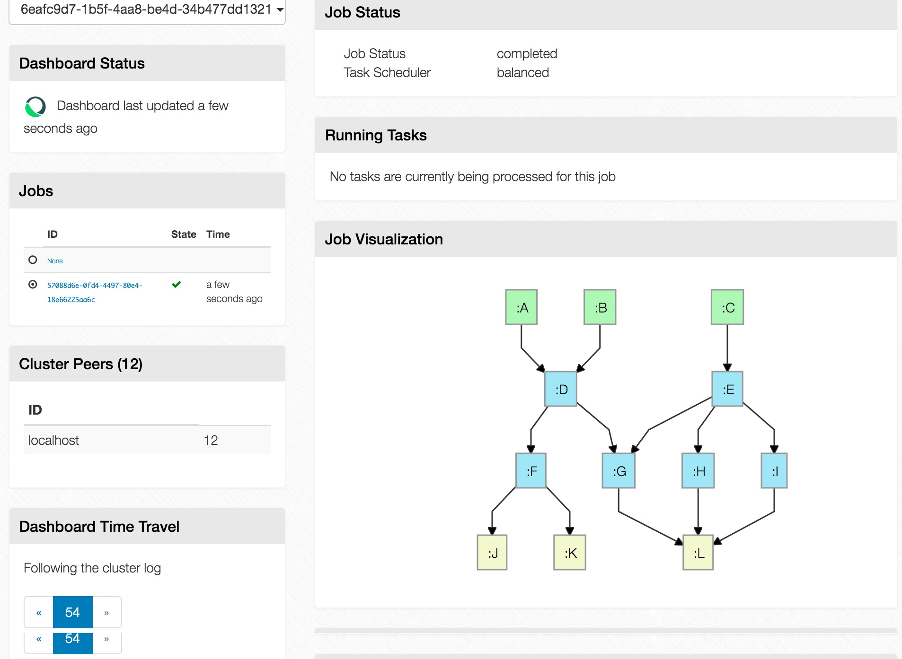

# onyx-dashboard

A dashboard for the [Onyx](https://github.com/onyx-platform/onyx) distributed computation system.



[](https://gitter.im/onyx-platform/onyx?utm_source=badge&utm_medium=badge&utm_campaign=pr-badge&utm_content=badge)

[](https://circleci.com/gh/onyx-platform/onyx-dashboard)

## Design and User Guide

A description and user guide disguised as a blog post can be found [here](http://lbradstreet.github.io/clojure/onyx/distributed-systems/2015/02/18/onyx-dashboard.html).

## Versioning

Version numbers will kept in sync with [Onyx]
(https://github.com/onyx-platform/onyx). For example, to use a version
compatible with Onyx `0.8.1.0-alpha8`, use a version of the dashboard beginning with
`0.8.1.0-alpha8`. The fourth version number will be reserved for dashboard versioning, in
order to provide releases out of band with Onyx.

## Development

In a terminal start a sample job and cluster to dashboard against:
```
lein run -m onyx.peer.dag-test
```

Then start developyment:

Run `lein repl` to start your repl.

In the REPL, run
```clojure
(onyx-dashboard.dev/start-figwheel)
```

Then run:

```clojure
(user/stop) (clojure.tools.namespace.repl/refresh) (user/go)
```
to start the server, and each time you make a change on the server.

Then point your browser at http://localhost:3000/

## Deployment

Run the jar via:
```
java -server -jar onyx-dashboard-VERSION.jar ZOOKEEPER_ADDR
```

By default the server will listen on port 3000, but this can be configured via the PORT environment variable.

Alternately, run the docker image like so:
```
docker run -e ZOOKEEPER_ADDR="192.168.1.170:2188" onyx/onyx-dashboard:tag
```

## License

Copyright © 2016 Distributed Masonry

Distributed under the Eclipse Public License either version 1.0 or (at your option) any later version.

## Chestnut

Created with [Chestnut](http://plexus.github.io/chestnut/) 0.7.0-SNAPSHOT (ecadc3ce).
